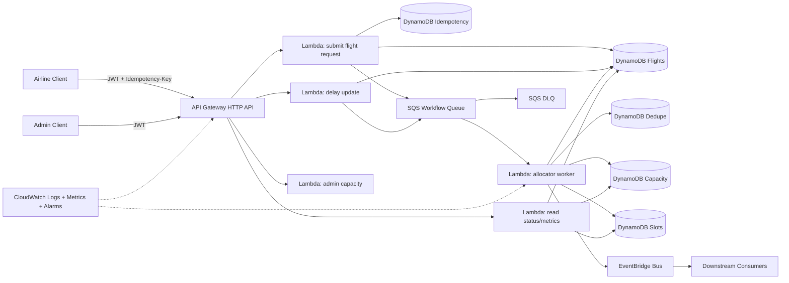

# SkyFlow

SkyFlow is a distributed, event-driven landing slot allocation system for a single airport that accepts flight slot requests, prioritizes emergency and international arrivals, enforces fairness across airlines, and continuously rebalances assignments on delay events with idempotent APIs, retry-safe queue processing, and production-grade observability/security controls.

## Architecture Overview



## Repository Structure

```text
skyflow/
  packages/
    domain/                # Pure domain models + allocation/rebalance engine
    application/           # Use-cases, ports/interfaces, in-memory adapters for tests
    shared/                # Logger, metrics, correlation, HTTP helpers
    aws-adapters/          # DynamoDB/SQS/EventBridge implementations of ports
    sdk/                   # Generated typed API client from OpenAPI
  services/
    api/                   # API Lambdas (HTTP handlers)
    allocator-worker/      # SQS consumer Lambda
  infra/
    bin/                   # CDK app entrypoint
    lib/                   # CDK stack/resources
  docs/
    architecture.md
    data-model.md
    api-contracts.md
    event-schemas.md
    operational-playbook.md
    adr/
      0001-single-airport-v1.md
      0002-sqs-workflow-with-eventbridge-notifications.md
      0003-dynamodb-table-strategy.md
  .github/workflows/
    ci.yml
  scripts/localstack/      # LocalStack start/bootstrap/e2e scripts
```

## Local Setup

Baseline tooling:
- Node.js `20.x` (project includes `.nvmrc`)
- Docker Desktop (`docker compose`)
- AWS CLI (`aws`)

Recommended before any run:

```bash
nvm use 20
node -v
docker --version
aws --version
```

1. Install dependencies:

```bash
npm install
```

2. Run lint + tests:

```bash
npm run lint
npm run test
```

3. Generate typed SDK from OpenAPI:

```bash
npm run sdk:generate
```

4. Build all packages:

```bash
npm run build
```

5. Synthesize infrastructure:

```bash
npm run cdk:synth
```

## LocalStack End-to-End Run

```bash
npm run local:e2e
```

This command:
- Cleans previous LocalStack state by default (override with `SKYFLOW_LOCAL_E2E_CLEAN=0`)
- Starts LocalStack (`docker compose`)
- Bootstraps DynamoDB/SQS/EventBridge resources
- Builds required workspace packages
- Executes a full request -> queue -> allocation -> delay-rebalance flow

## Deploy to AWS

Prerequisites:
- AWS CLI configured
- CDK bootstrap completed for target account/region
- Node.js 20+

```bash
cd infra
npx cdk bootstrap
cd ..
npm run cdk:deploy
```

After deploy, use stack outputs for `ApiEndpoint`, `UserPoolId`, and `UserPoolClientId`.

## API and Event Docs

- [Architecture](docs/architecture.md)
- [Data Model & Access Patterns](docs/data-model.md)
- [API Contracts](docs/api-contracts.md)
- [OpenAPI Spec](docs/openapi.json)
- [Event Schemas](docs/event-schemas.md)
- [Operational Playbook](docs/operational-playbook.md)

## Reliability and Security Highlights

- API idempotency via `Idempotency-Key` + persistent request hash table.
- Queue processing effectively-once via dedupe table with conditional writes.
- SQS retries with DLQ redrive policy.
- Structured JSON logs with correlation IDs.
- CloudWatch EMF custom metrics and DLQ alarm.
- JWT authorization with AIRLINE vs ADMIN role enforcement.
- Least-privilege IAM grants in CDK per Lambda responsibility.
