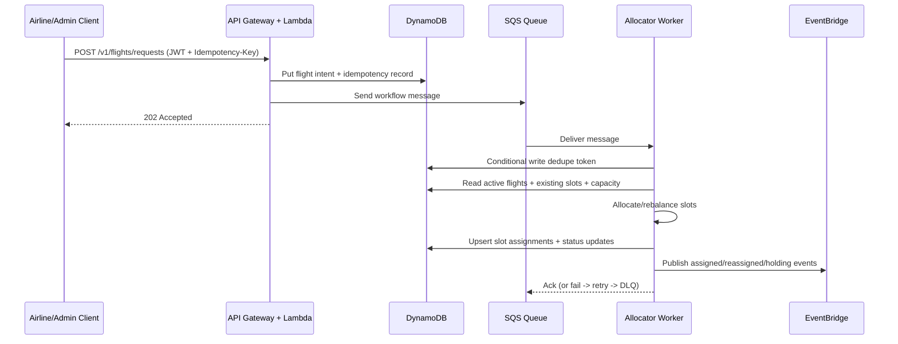

# SkyFlow Architecture

## Problem Statement

SkyFlow allocates and rebalances airport landing windows under congestion by combining request-driven APIs and asynchronous workflow processing, ensuring high-priority handling, fairness across airlines, and operational stability through idempotency, retries, DLQ isolation, and observability.

## Components

- API Gateway HTTP API: authenticated HTTP ingress.
- API Lambdas: validate requests, enforce role-based access, persist intent, enqueue workflow messages.
- SQS Workflow Queue + DLQ: decoupled processing and failure isolation.
- Allocator Worker Lambda: deterministic allocation/rebalance engine execution.
- DynamoDB tables: flights, slot allocations, idempotency records, dedupe/event log, capacity config.
- EventBridge Bus: domain event fan-out for downstream systems.
- CloudWatch: logs, metrics, alarm on DLQ buildup.

## Diagram

